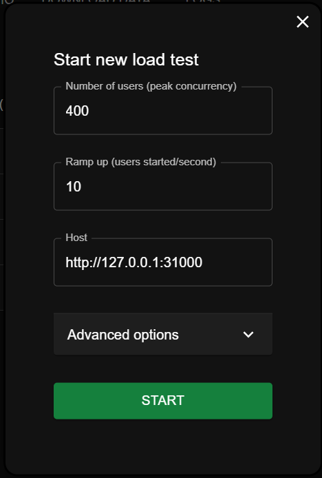
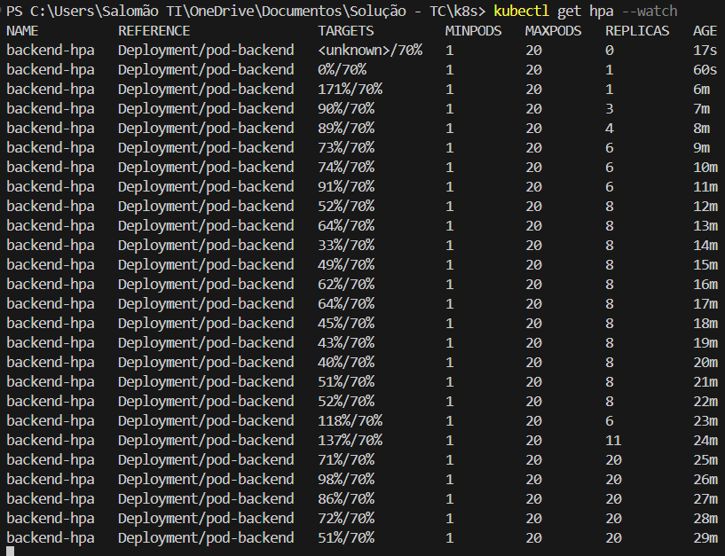

# Tech Challenge - Sistema Ambrosia

## Contexto

Ambrosia é um sistema para gestão de pedidos de um restaurante, com todos os processos gerenciados através de uma API capaz de administrar os clientes, produtos do cardápio e os pedidos realizados.

Os produtos são divididos entre Lanches, Acompanhamentos, Bebidas e Sobremesas.
    
O cliente poderá acompanhar os status do pedido, sendo eles: Recebido, Em preparação, Pronto e Finalizado e o atendente/funcionário poderá atualizar estes status em tempo real.

- Projeto desenvolvido com base na Arquitetura Limpa:


- Backend desenvolvido com o framework [FastAPI](https://fastapi.tiangolo.com/), em Python. 
- O banco de dados utilizado é o [MySQL](https://www.mysql.com/).
- O projeto é executado em containers, com o [Kubernetes](https://kubernetes.io/) e [Docker](https://www.docker.com/). <i>Você precisa ter o Docker instalado na sua máquina, e o Kubernetes habilitado, para executar a API.</i>
- O sistema é integrado ao [Mercado Pago](https://www.mercadopago.com.br/developers/pt/reference).

### Arquitetura

O prjeto possui duas imagens-base, uma com o banco de dados e outra com o backend do projeto. Gerenciada pelo Kubernetes, a arquitetura do backend possui um hpa (Horizontal Pod Autoscaling), que aumenta e diminui automaticamente a quantidade de pods ativos de acordo com métricas de CPU pré-definidas.


<!-- ## Rodando o projeto

O projeto tem instruções para a criação de dois containers, orquestrados com o Docker Compose. 

### Subir o docker-compose

Na pasta `root` do repositório:

```bash
docker-compose up
```
Ou, para rodar os containers em segundo plano:
```bash
docker-compose up -d
```

Para apagar os containers criados:
```bash
docker rm tc_api -f; docker rm tc_database -f; 
``` -->

## Executando o sistema com Kubernetes

A pasta k8s possui instruções para execução dos containers com kubernetes (k8s), incluindo autoescalonamento horizontal de pods (HPA).

O k8s será executado com base nas seguintes imagens no docker hub: [salomaopolegar/restaurante:1.3](https://hub.docker.com/r/salomaopolegar/restaurante) e [salomaopolegar/banco:1.3](https://hub.docker.com/r/salomaopolegar/banco)

Para iniciar o projeto, entrar na pasta k8s e executar os seguintes comandos: 

```bash
kubectl apply -f secret-mysql.yaml; 
kubectl apply -f configmap.yaml; 
kubectl apply -f deployment-backend.yaml; 
kubectl apply -f deployment-mysql.yaml; 
kubectl apply -f svc-backend.yaml; 
kubectl apply -f svc-mysql.yaml; 
kubectl apply -f metrics.yaml; 
kubectl apply -f hpa.yaml
```

Para monitorar o autoprovisionamento de pods:
```bash
kubectl get hpa --watch
```

Para monitorar os pods criados:
```bash
kubectl get pods --watch
```

## Acessar a documentação da API

A documentação da API contém uma lista de todos os endpoints do serviço. Para acessá-la, após a execução da etapa anterior, acesse a URL:
<!-- -  [http://127.0.0.1/docs](http://127.0.0.1/docs) ou [http://127.0.0.1/redoc](http://127.0.0.1/redoc), se rodou com o docker compose. -->

-  [http://127.0.0.1:31000/docs](http://127.0.0.1:31000/docs) ou [http://127.0.0.1:31000/redoc](http://127.0.0.1:31000/redoc), se rodou com o k8s.

## Instruções ###

Novos endpoints desaa fase:

- 1.	Checkout Pedido que deverá receber os produtos solicitados e retornar a identificação do pedido.

Requisição POST no seguinte endpoint:

```bash 
POST:

http://127.0.0.1:31000/pedidos/checkout/
```

BODY da requisição:
```bash
{
    "id_cliente": 1,
    "itens": [
        {
            "produto": 3,
            "quantidade": 5,
            "descricao": "sem tomate",
            "valor": 15.2
            
        },
        {
            "produto": 2,
            "quantidade": 3,
            "descricao": "com tomate",
            "valor": 11
            
        }
    ]
}
```

- ii.	Consultar status pagamento pedido, que informa se o pagamento foi aprovado ou não.

Requisição GET no seguinte endpoint:

```bash 
GET:

http://127.0.0.1:31000/pedidos/{id_pedido}/status_pagamento/
```

Retorno da requisição:
```bash
"1" --> Pagamento Enviado
"2" --> Aprovado
"3" --> Recusado
```

- iii.	Webhook para receber confirmação de pagamento aprovado ou recusado.

Requisição POST no seguinte endpoint:

```bash 
POST:

http://127.0.0.1:31000/pedidos/status_pagamento/
```

BODY da requisição:
```bash
{
    "id": "b715bik7-2726-4d51-a729-749cc7bda703",
    "type": "payment",
    "date_created": "2015-03-25 10:04:58",
    "user_id": 44444,
    "api_version": "v1",
    "action": "state_CANCELED"
}
```

Onde:

```bash
"action": "state_CANCELED" --> Pagamento cancelado
"action": "state_FINISHED" --> Pagamento realizado com sucesso
```
Obs.: no exemplo acima, o id_pagamento foi pré-configurado diretamente no banco de dados, e deve retornar o pedido com id 1. Ao criar um novo pagamento, o sistema retorna o id do pagamento recebido do gateway de pagamento, e armazena na tabela de pedidos.

- iv. A lista de pedidos deverá retorná-los com suas descrições, ordenados com a seguinte regra:
        1. Pronto &gt; Em Preparação &gt; Recebido;
        2. Pedidos mais antigos primeiro e mais novos depois;
        3. Pedidos com status Finalizado não devem aparecer na lista.

Requisição no seguinte endpoint:

```bash 
GET:

http://127.0.0.1:31000/pedidos/
```

- v.	Atualizar o status do pedido.

<i>Para alterar o status do pedido, usamos o PUT com o endpoint de pedido, enviando um objeto com o ID e os dados a serem editados (no caso, o status):</i>

```bash 
PUT:

http://127.0.0.1:31000/pedidos/
```

Body da requisição:
```bash
{
    "id": 2,
    "status_pedido": 4
}
```


### Pagamento
Integração com Mercado Pago para gerar o QRCode para pagamento e integrar com o WebHook para capturar os pagamentos realizados. 

Como referência, acesse o <a href="https://www.mercadopago.com.br/developers/pt/docs/qr-code/integration-configuration/qr-dynamic/integration" rel="noopener" target="_blank">site do mercado pago</a>.

Ao realizar o checkout do pagamento, o sistema envia um pedido de pagamento ao sistema do MercadoPago, salvando no bando de dados o id do pagamento retornado pelo MercadoPago.

Para receber a confirmação do pagamento, foi configurado um endpoint POST (WebHook) em que o MercadoPago vai enviar uma confirmação de pagamento ou de cancelamento.

A requisição recebida segue o seguinte padrão:

```bash
{
    "id": "b715bik7-2726-4d51-a729-749cc7bda703",
    "type": "payment",
    "date_created": "2015-03-25 10:04:58",
    "user_id": 44444,
    "api_version": "v1",
    "action": "state_CANCELED"
}
```

onde:
<i>
```bash
"action": "state_FINISHED" --> FINALIZADO
"action": "state_CANCELED" --> CANCELADO
```
</i>

## Realizando Testes de Carga

A pasta \stress_test\ possui o arquivo locustfile.py, que reliza teste simples com a biblioteca locust.
Para executar os testes, é necessário instalar essa biblioteca e executar o seguinte comando:

```bash 
pip install locust
```

```bash
locust -f locustfile.py
```

Após executar o arquivo, acessar [http://localhost:8089/](http://localhost:8089/) e digitar os seguintes parâmetros:



Ao clicar em START, o teste de carga será iniciado.

Podemos verificar o funcionamento do HPA do Kubernetes via terminal:




## Demonstração

https://youtube.com/dkjsafnksjdfbsdfsdhf

## Créditos
Sistema e documentação desenvolvidos por [Salomão Pôlegar](https://www.linkedin.com/in/salomao-polegar/).